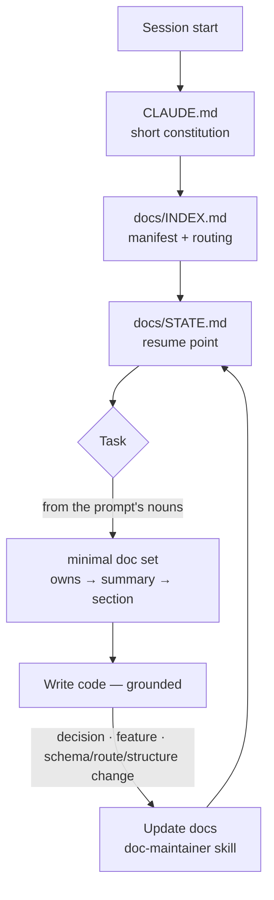

# ai-docs-template

<sub>[Türkçe](README.md) · **English**</sub>

**A self-maintaining `docs/` architecture that Claude Code is 100% fluent in.**
An adaptive (tiered) documentation template that works for any project and is
optimized for web projects.

> **Core principle:** **You never write the docs.** Claude Code creates and updates
> the entire `docs/` folder — you just ask for code, and the memory maintains itself
> in the background. The docs are written **for the AI that writes the code**, not for
> humans: so it stays faithful to the project and works efficiently (this README and
> the `/docs-init` interview are the only human-facing exceptions).

---

## How it works (at a glance)



Every session follows this loop: **orient cheaply → read minimally → write grounded
code → auto-update the docs.** You only ask for code; the memory keeps itself.

---

## Why?

Multi-session development with an AI needs persistent **memory**: every session starts
from scratch and must recall prior decisions and where work left off. This template
turns that memory into a standard, predictable, self-healing structure:

- **One boot path** — each session Claude reads `CLAUDE.md` → `docs/INDEX.md` →
  `docs/STATE.md`, in order, and is fully oriented.
- **Deterministic write paths** — every kind of fact has one canonical home (the
  routing table in `INDEX.md`). The AI never guesses where to write.
- **Tiered** — a small core exists in every project; as it grows, the AI adds docs by
  the rules. Scales from a tiny script to a large SaaS.
- **Single source of truth (SSOT)** — every doc declares what it `owns`; nobody
  restates another doc's facts, they just link.
- **Self-healing** — the full rules live in `docs/_meta/DOCS_SYSTEM.md`; `CLAUDE.md`
  is its summary. On conflict, the spec wins.
- **AI-optimized read path** — a minimal doc set + layered reading (few tokens); it
  never invents what it hasn't read (says "not documented"); it **spot-checks** a
  stale doc against the code; on multi-subsystem tasks it reads the *edges (seams)*.
  Detail: `§14–§17`.
- **Negative knowledge too** — project-specific must/never rules, pitfalls, and
  **failed approaches** (`guardrails.md`) → the AI doesn't repeat the same mistake.

Language: the rules, templates, and structure are in **English**; generated doc
*content* follows your project's language. This README has a Turkish counterpart, and
the `/docs-init` interview runs in the user's language.

---

## How to use

1. Create a new repo with **"Use this template"** on GitHub (or clone this repo).
2. Open the project with Claude Code.
3. Bootstrap:
   - **Empty / new project** → **`/docs-init`**: scans the repo, asks you **~6 short
     questions**, drafts the Tier-0 docs, and **asks for confirmation before writing**.
   - **Existing / ongoing project** (already has code) → **`/docs-adopt`**: deep-scans
     the code, ingests any existing README/docs **without loss** (into `_ingest/`),
     reconstructs the real tier (Tier-1/2) and retroactive ADRs, and confirms first.
     If the project already has a mature docs system, it switches to a non-destructive
     **overlay** (adds only what's missing, in your conventions).
4. Start building. The docs update **automatically** — an ADR when you decide, a spec
   when a feature starts, `tech-stack` when a dependency changes, and so on.
5. Occasionally run **`/docs-audit`** to check the docs against the code.

> **Parallel work:** running several workstreams (branches) at once? Use a separate
> `git worktree` for each; never open two sessions in the same working directory. Each
> feature's live state lives in its spec's `## Current state`, and `STATE.md` becomes a
> thin dashboard. Detail: `docs/_meta/DOCS_SYSTEM.md §10`.

---

## Commands

| Command | What it does |
|---------|--------------|
| `/docs-init` | Bootstrap (empty/new repo): interview + generates the Tier-0 docs. |
| `/docs-adopt` | Bootstrap (**existing project**): deep-scans the code, ingests existing docs without loss, reconstructs the real tier and retroactive ADRs (or overlays a mature docs system). |
| `/docs-audit` | Read-only drift check: compares the docs against code/git. |
| `/docs-status` | Read-only dashboard: where things stand — now / next / blockers / questions waiting on you / progress / recent decisions (+ a "since you left" git digest). |
| `/docs-skills` | Analyzes the project and recommends at most 2–3 skills from a curated catalog; each install needs your explicit yes (the skill is read in full first). |
| `/adr "<title>"` | Creates the next Architecture Decision Record. |
| `/feature "<name>"` | Creates the next feature spec (opens the `features/` area). |
| `/handoff` | Flushes the resume point to disk (session end / before context compaction). |
| `/docs-upgrade` | Upgrades the template machinery to the latest version and applies content migrations (without touching your project content). |

The engine of autonomy is the `doc-maintainer` **skill**: Claude updates the docs
itself whenever a relevant event happens (a decision, a feature, a
dependency/route/schema/structure change, session end) — without you asking.

---

## Doc map

```
CLAUDE.md                     # Short constitution + boot rule (loaded every session)
docs/
  INDEX.md                    # Manifest + routing table + freshness (boot read #1)
  STATE.md                    # Resume point / live working memory (boot read #2)
  project-brief.md            # Vision, users, scope, non-goals, constraints
  architecture.md             # System shape, boundaries, invariants, source map
  tech-stack.md               # Technologies + versions (SSOT)
  decisions/                  # ADRs (append-only, status-tracked)
  _meta/
    DOCS_SYSTEM.md            # Full rules (authoritative, self-healing)
    templates/                # Blank schemas the AI copies
    examples/                 # Filled reference docs
    VERSION                   # Template version (SemVer)
    MIGRATIONS.md             # Cross-version content-migration guide
  # Tier 1+ (the AI creates them on trigger):
  requirements.md · roadmap.md · implementation-map.md · guardrails.md
  data-model.md · glossary.md · keys.md · api/ · features/ · conventions/ · guides/
  # Tier 2:
  operations/ · api/openapi.yaml · architecture-components.md
CHANGELOG.md                  # Keep a Changelog
.claude/                      # commands/ + skills/doc-maintainer
```

### Tiers

| Tier | When | Adds |
|------|------|------|
| **0 — Core** | Every project (`/docs-init`) | INDEX, STATE, project-brief, architecture, tech-stack, decisions, DOCS_SYSTEM |
| **1 — Growing** | First real feature / API / data model | requirements, roadmap, data-model, api/, features/, conventions/, glossary, guides/ |
| **2 — Complex** | Prod / multi-service / multi-contributor | operations/, openapi.yaml, architecture-components |
| **3 — Federated** | A doc exceeds its cap / many subsystems / large monorepo | Partition: `architecture/<subsystem>.md`, `data-model/<domain>.md`, index-of-indexes, scoped/incremental audit (`DOCS_SYSTEM §13`) |

---

## Versioning & upgrades

The template is versioned with **SemVer** (`docs/_meta/VERSION`). When a project is
bootstrapped (`/docs-init` or `/docs-adopt`), the current version and source are
stamped into `docs/INDEX.md` front-matter (`template_version`, `template_source`).

When the template improves later, run **`/docs-upgrade`** in your project: it fetches
the latest *machinery* (`.claude/`, `docs/_meta/`, `CLAUDE.md`'s managed block) and
applies any needed **content migrations** (`MIGRATIONS.md`) with a preview + your
confirmation — **without ever touching your project content** (decisions,
architecture, specs).

**Key distinction:** *machinery* files are upstream-owned and never hand-edited
(upgrade overwrites them). Put your project-specific rules **outside** `CLAUDE.md`'s
managed block; if you need a custom command, add a **new** file. Detail:
`docs/_meta/DOCS_SYSTEM.md §12`.

## Making this repo a template

To make your own copy a GitHub template others can use: check **Settings → General →
"Template repository"** on GitHub.

## License

[MIT](LICENSE).
