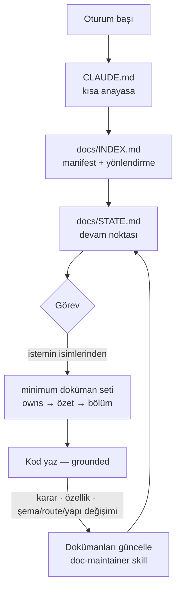

# ai-docs-template

<sub>**Türkçe** · [English](README.en.md)</sub>

**Claude Code'un %100 hakim olduğu, kendi kendini yöneten bir `docs/` mimarisi.**
Her tür projeyle uyumlu, web projeleri için optimize edilmiş, uyarlanabilir
(katmanlı) bir dokümantasyon şablonu.

> **Temel ilke:** Dokümanları **siz yazmazsınız**. Tüm `docs/` klasörünü Claude
> Code oluşturur ve günceller — siz sadece kod isteyin, dokümanlar arkada kendini
> tutar. Dokümanlar insanlar için değil, **kodu yazan yapay zeka için**dir: projeye
> sadık kalması ve en verimli şekilde çalışması için (bu README ve `/docs-init`
> röportajı, insana bakan tek istisnalardır).

---

## Nasıl çalışır (bir bakışta)



Her oturum bu döngüyü izler: **ucuz yönlen → minimum oku → grounded kod yaz →
dokümanları otomatik güncelle.** Siz yalnızca kod istersiniz; hafıza arkada kendini tutar.

---

## Neden?

AI ile çok oturumlu geliştirme yaparken yapay zekânın kalıcı bir "hafızaya"
ihtiyacı vardır: her oturum sıfırdan başlar, önceki kararları ve nerede kalındığını
hatırlaması gerekir. Bu şablon o hafızayı standart, öngörülebilir ve kendini
onaran bir yapıya kavuşturur:

- **Tek açılış yolu** — Claude her oturum başında sırayla `CLAUDE.md` → `docs/INDEX.md`
  → `docs/STATE.md` okur ve tam yönlenir.
- **Belirleyici yazım yolları** — her bilgi türünün tek bir kanonik yeri vardır
  (`INDEX.md` içindeki yönlendirme tablosu). AI nereye yazacağını asla tahmin etmez.
- **Katmanlı** — küçük bir çekirdek her projede vardır; proje büyüdükçe AI yeni
  dokümanları kurallara göre ekler. Küçük script'ten büyük SaaS'a ölçeklenir.
- **Tek doğruluk kaynağı (SSOT)** — her doküman neyin sahibi olduğunu (`owns`)
  bildirir; kimse başka bir dokümandaki bilgiyi tekrar etmez, sadece bağ verir.
- **Kendi kendini onarır** — tüm kuralların tam metni `docs/_meta/DOCS_SYSTEM.md`
  içindedir; `CLAUDE.md` onun özetidir. Çelişki olursa spec kazanır.
- **AI için optimize okuma yolu** — minimum doküman seti + katmanlı okuma (az token);
  okumadığını uydurmaz ("belgelenmemiş" der); bayat dokümanı koda karşı **dar
  doğrular**; çok-alt-sistemli görevde _kenarları (seams)_ okur. Detay: `§14–§17`.
- **Negatif bilgi de var** — projeye özel "asla/hep" kuralları, tuzaklar ve
  **başarısız yaklaşımlar** (`guardrails.md`) → AI aynı hatayı tekrarlamaz.

Dil: kurallar, şablonlar ve yapı **İngilizce**; oluşturulan doküman _içeriği_
projenizin diline göre yazılır. Bu README ve `/docs-init` röportajı **Türkçe**.

---

## Nasıl kullanılır

1. GitHub'da **"Use this template"** ile yeni bir repo oluşturun (veya bu repoyu
   klonlayın).
2. Projeyi Claude Code ile açın.
3. Bootstrap:
   - **Boş/yeni proje** → **`/docs-init`**: repoyu tarar, size **~6 kısa soru**
     sorar, Tier-0 dokümanlarını taslak hazırlar ve **yazmadan önce onay ister**.
   - **Mevcut/süregelen proje** (kodu zaten olan) → **`/docs-adopt`**: kodu derin
     tarar, mevcut README/docs içeriğini **kayıpsız** içeri alır (`_ingest/` altına),
     gerçek katmanı (Tier-1/2) ve retroaktif ADR'leri kurar, yine onay ister.
4. Artık kod geliştirmeye başlayın. Dokümanlar **otomatik** güncellenir — karar
   verdikçe ADR, özellik başladıkça spec, bağımlılık değiştikçe tech-stack, vb.
5. Ara sıra **`/docs-audit`** ile dokümanların kod ile tutarlılığını denetleyin.

> **Paralel çalışma:** Aynı anda birden fazla iş akışı (branch) yürütüyorsanız her
> biri için ayrı bir `git worktree` kullanın; asla aynı çalışma dizininde iki oturum
> açmayın. Her özelliğin canlı durumu kendi feature spec'inin `## Current state`
> bölümünde tutulur; `STATE.md` ince bir panoya dönüşür. Ayrıntı:
> `docs/_meta/DOCS_SYSTEM.md §10`.

---

## Komutlar

| Komut             | Ne yapar                                                                                                                                           |
| ----------------- | -------------------------------------------------------------------------------------------------------------------------------------------------- |
| `/docs-init`      | Bootstrap (boş/yeni repo): röportaj + Tier-0 dokümanlarını üretir.                                                                                 |
| `/docs-adopt`     | Bootstrap (**mevcut proje**): kodu derin tarar, varsa mevcut dokümanları kayıpsız içeri alır, gerçek katmanı ve retroaktif ADR'leri yeniden kurar. |
| `/docs-audit`     | Salt-okunur sapma denetimi: dokümanları kod/git ile karşılaştırır.                                                                                 |
| `/docs-status`    | Salt-okunur gösterge paneli: neredeyiz — şu an / sıradaki / blocker / sizi bekleyen sorular / ilerleme / son kararlar (+ "siz yokken" git özeti).   |
| `/adr "<başlık>"` | Bir sonraki mimari karar kaydını (ADR) oluşturur.                                                                                                  |
| `/feature "<ad>"` | Bir sonraki özellik spec'ini oluşturur (features/ alanını açar).                                                                                   |
| `/handoff`        | Devam noktasını diske yazar (oturum sonu / context compaction öncesi).                                                                             |
| `/docs-upgrade`   | Şablon makinesini en son sürüme günceller ve içerik göçünü uygular (proje içeriğine dokunmadan).                                                   |

Otonominin motoru `doc-maintainer` **skill**'idir: Claude, işi sırasında ilgili bir
olay olduğunda (karar, özellik, bağımlılık/route/şema/yapı değişimi, oturum sonu)
dokümanları kendisi günceller — siz istemeden.

---

## Doküman haritası

```
CLAUDE.md                     # Kısa anayasa + açılış kuralı (her oturum yüklenir)
docs/
  INDEX.md                    # Manifest + yönlendirme tablosu + tazelik (açılış #1)
  STATE.md                    # Devam noktası / canlı çalışma hafızası (açılış #2)
  project-brief.md            # Vizyon, kullanıcılar, kapsam, non-goal, kısıtlar
  architecture.md             # Sistem yapısı, sınırlar, değişmezler, kaynak haritası
  tech-stack.md               # Teknolojiler + sürümler (SSOT)
  decisions/                  # ADR'ler (append-only, durum takipli)
  _meta/
    DOCS_SYSTEM.md            # Tam kurallar (yetkili kaynak, kendini onarır)
    templates/                # AI'nin kopyaladığı boş şemalar
    examples/                 # Doldurulmuş örnek dokümanlar (referans)
    VERSION                   # Şablon sürümü (SemVer)
    MIGRATIONS.md             # Sürümler arası içerik göç kılavuzu
  # Tier 1+ (tetiklendikçe AI oluşturur):
  requirements.md · roadmap.md · implementation-map.md · guardrails.md
  data-model.md · glossary.md · keys.md · api/ · features/ · conventions/ · guides/
  # Tier 2:
  operations/ · api/openapi.yaml · architecture-components.md
CHANGELOG.md                  # Keep a Changelog
.claude/                      # commands/ + skills/doc-maintainer
```

### Katmanlar

| Katman            | Ne zaman                                                     | Ekler                                                                                                                             |
| ----------------- | ------------------------------------------------------------ | --------------------------------------------------------------------------------------------------------------------------------- |
| **0 — Çekirdek**  | Her projede (`/docs-init`)                                   | INDEX, STATE, project-brief, architecture, tech-stack, decisions, DOCS_SYSTEM                                                     |
| **1 — Büyüyen**   | İlk gerçek özellik / API / veri modeli                       | requirements, roadmap, data-model, api/, features/, conventions/, glossary, guides/                                               |
| **2 — Karmaşık**  | Prod / çok servis / çok geliştirici                          | operations/, openapi.yaml, architecture-components                                                                                |
| **3 — Federatif** | Bir doküman cap'ini aşıyor / çok alt-sistem / büyük monorepo | Bölümleme: `architecture/<alt-sistem>.md`, `data-model/<domain>.md`, index-of-indexes, kapsamlı/artımlı audit (`DOCS_SYSTEM §13`) |

---

## Sürümleme ve güncelleme

Şablon **SemVer** ile sürümlenir (`docs/_meta/VERSION`). Bir projeyi bootstrap
ederken (`/docs-init` veya `/docs-adopt`), o anki sürüm ve kaynak `docs/INDEX.md`
front-matter'ına damgalanır (`template_version`, `template_source`).

Şablon ileride iyileştirildiğinde, projenizde **`/docs-upgrade`** çalıştırın:
en son _machinery_'i (`.claude/`, `docs/_meta/`, `CLAUDE.md`'nin yönetilen bloğu)
çeker ve gerekli **içerik göçlerini** (`MIGRATIONS.md`) önizleme+onayla uygular —
proje içeriğinize (kararlar, mimari, spec'ler) asla dokunmadan.

**Önemli ayrım:** _Machinery_ dosyaları yukarı-akış sahibidir, elle düzenlenmez
(upgrade üzerine yazar). Projeye özel kurallarınızı `CLAUDE.md`'nin yönetilen blok
**dışına** yazın; özel bir komut gerekiyorsa **yeni** bir dosya ekleyin. Ayrıntı:
`docs/_meta/DOCS_SYSTEM.md §12`.

## Lisans

[MIT](LICENSE).
