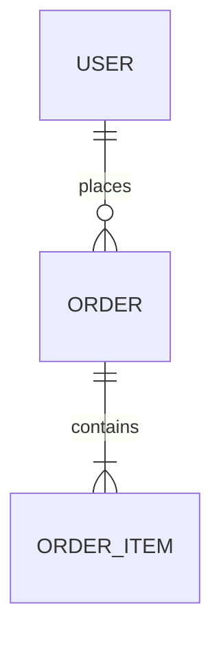

# Data Model

> Logical model only. Physical schema lives in migrations/code — link paths, don't
> copy DDL.

## Entity overview

## Entities

### <Entity>
- **Fields:** name (type, constraints) …
- **Invariants:** rules that must always hold (e.g. "email is unique").
- **PII:** which fields are personal data.

## Relationships

| From | To | Cardinality | Notes |
|------|----|-------------|-------|
| User | Order | 1..* | … |

## Data lifecycle

Retention, soft-delete, anonymisation. Migrations strategy → link `operations/` if present.
