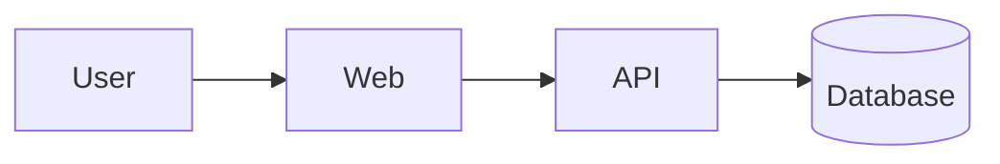

# Architecture

> ⚠️ **NOT BOOTSTRAPPED.** Run **`/docs-init`**. Sections below are the schema.
> This doc owns *structure and invariants*, not code detail — link paths, don't
> copy signatures or file trees.

## Overview

<≤5 lines: the shape of the system at a glance.>

## Components

C4 Level-2 (containers): apps, services, datastores, queues.

| Component | Responsibility | Talks to |
|-----------|----------------|----------|
| <name> | <what it does> | <deps> |

## Boundaries & data flow

<2–4 critical request/data paths, described briefly.>

## Invariants

<Rules that must always hold across the system — the things a change must not break.>

## Tech philosophy

<Guiding principles: e.g. "server-first", "typed end-to-end". Link ADRs for each.>

## Source map

| Path | Responsibility |
|------|----------------|
| `src/...` | <what lives here> |
